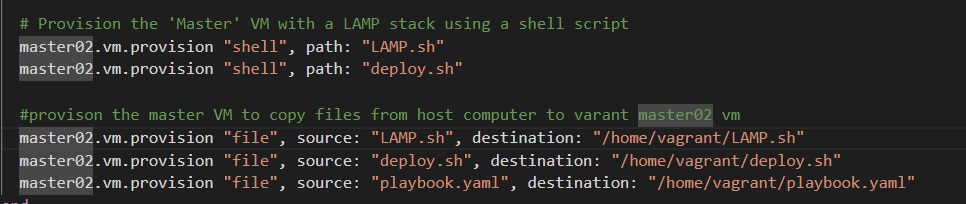
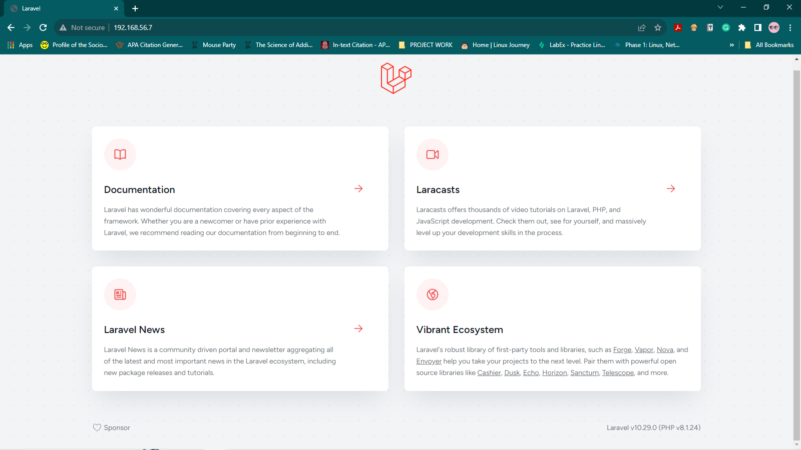
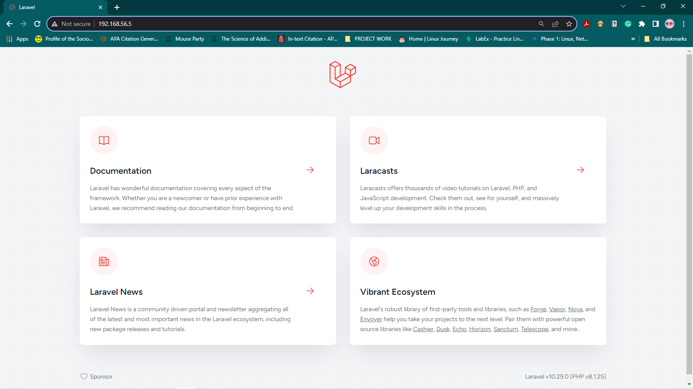
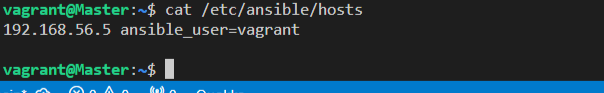
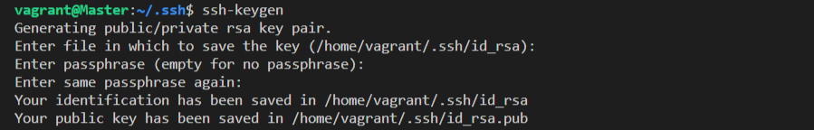
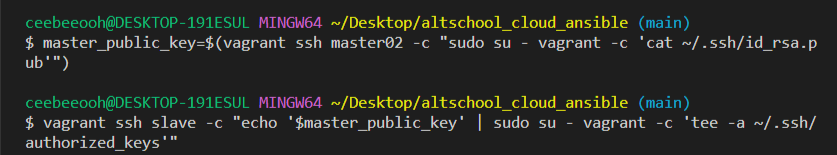

# LAMP Stack and Laravel Deployment Script

This Bash script automates the setup of a LAMP (Linux, Apache, MySQL, PHP) stack and deploys a Laravel application.

## Prerequisites

Before running this script, ensure you have the following:

- Vagrant setup
- A Linux environment (e.g., Ubuntu)
- Root or sudo access to your server

## Usage

1. Clone the repository containing this script.

2. Make the script executable:

   ```bash
   chmod +x setup_lamp_and_laravel.sh

3. Run the script:
   `./LAMP.sh`
   `./deploy.sh`

Alternatively, using vagrant, replace step 3 with provisioning on the master VM:
  `master02.vm.provision "shell", path: "LAMP.sh"`
  `master02.vm.provision "shell", path: "deploy.sh"`
  
Then run:
`Vagrant up --provision`       

## What the Script Does
This script performs the following tasks:

1. Installs Apache, MySQL, and PHP.
2. Creates a PHP test file in the default document root.
3. Configures Apache virtual hosts for Laravel.
4. Sets up the Laravel project and installs its dependencies.
5. Generates an application key and configures the environment.
6. Disables the default Apache page.
7. Starts the web server.

## Accessing Your Website

After running the script successfully, you can access your Laravel website by navigating to:

Master Node: http://master-node-ip

Slave Node: http://slave-node-ip


## Notes

This script assumes a basic LAMP stack setup. Modify it as needed for your specific requirements.

You may need to customize your Laravel configuration further, depending on your project.

This script was copied and executed on the slave server using ansible.

# Ansible Playbook: Provision Slave

This Ansible playbook provisions a target host (slave VM) by copying scripts for setting up a LAMP stack and deploying a Laravel application. Additionally, it sets up a cron job to check the server's uptime at 12 AM daily.

## Prerequisites

Before using this playbook, ensure that you have the following:

- Ansible installed on your control machine. You can follow the ansible documentation on how to setup [here](https://docs.ansible.com/ansible/latest/installation_guide/index.html)
- Proper SSH access to the target host(s). In this case, Slave VM
- The `LAMP.sh` and `deploy.sh` scripts are available on the control machine. (INSERT PROVISIONING SCREENSHOT OF MASTER)
- Properly configured inventory file (hosts file) to specify the target host. After the ansible installation, the hosts file can be found in the /etc/ansible directory. it should contain the ip address of the target host.(INSERT ETC/ANSIBLE IMAGE)

## Usage

1. Clone this repository to your control machine:

   ```bash
   git clone https://github.com/your-repo/ansible-playbook.git

2. Edit your inventory file (hosts) to specify the target host or group.

3. Run the playbook:
   `ansible-playbook playbook.yaml`

## Playbook Structure
- playbook.yaml: The main Ansible playbook file.
- hosts: The inventory file where you define target hosts.

## Tasks
This playbook contains the following tasks:

1. Copy script for setting up LAMP into the slave VM:
      - Copies the LAMP.sh script to the slave VM.

2. Copy script for setting up Laravel application into the slave VM:
     - Copies the deploy.sh script to the slave VM.

3. Cron job to check server's uptime at 12 AM daily:
   - Sets up a cron job named check_uptime that runs daily at 12 AM.
   - The job appends the server's uptime information to /var/log/uptime.log.

## Example Inventory (hosts) File

[slaves]
your-slave-vm-ip ansible_ssh_user=your-ssh-user ansible_ssh_host=your-slave-vm-ip
192.68.56.5 ansible_user=vagrant



## Notes
Ensure that your SSH key is properly set up for passwordless access to the target host.
- For my project, after spinning up both machines, i sshed into the master vm and ran the command `ssh-keygen` to create a private/public key pair, then exited the vm.


 On the host system, run the command `master_public_key=$(vagrant ssh master02 -c "sudo su - vagrant -c 'cat ~/.ssh/id_rsa.pub'")` to create a variable which stores the value of the public key.

- Next run the command `vagrant ssh slave -c "echo '$master_public_key' | sudo su - vagrant -c 'tee -a ~/.ssh/authorized_keys'"`
the above command logs into the slave vm as vagrant and copies the contents of the `$master_public_key` variable into the `~/.ssh/authorized_keys` directory on the slave vm.
 

- On the master vm, run `ssh vagrant@slave-ip-address` in the terminal. you should be able to ssh into the slave vm.


Customize the LAMP.sh and deploy.sh scripts as needed for your specific LAMP and Laravel setup.   


## Author
Chinwoke Onuekwusi


For further information on how to use this script and set up your LAMP stack and Laravel application, please refer to this README file.

